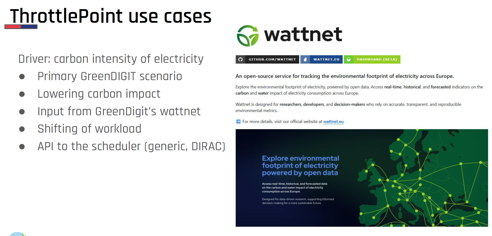
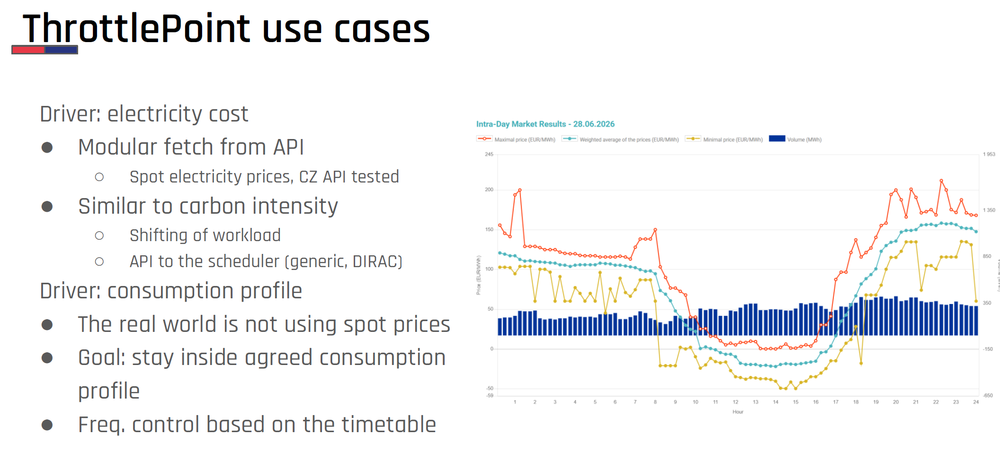
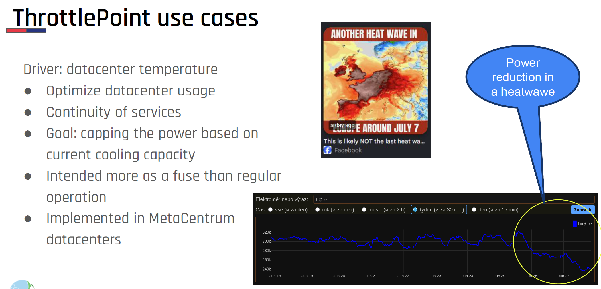
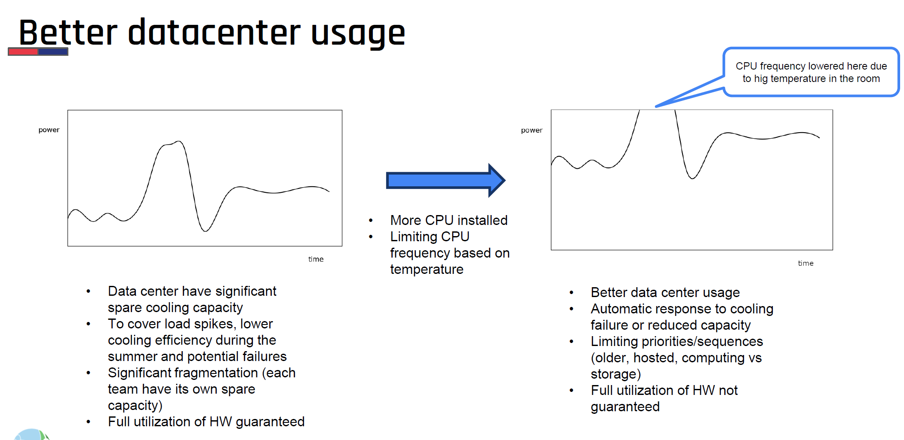

# ThrottlePoint

**Energy Optimization Governor** for HPC systems.

ThrottlePoint dynamically caps CPU frequency and NVIDIA GPU power based on
electricity price, grid carbon intensity, and temperature. Which signals drive
the decision is fully configurable, and you can plug in your own temperature
source.

It runs from cron as root, with no daemon and no batch-system integration. Each
run reads the signal its mode is configured for — a 1–10 rating from
price and carbon intensity, or a temperature band — and sets the CPU's maximum
scaling frequency accordingly. Running jobs are never signalled, paused, or
killed; they run under a lower clock ceiling while conditions are bad.

All the functionality and code logic located in `src/hpc_eff` stem from
https://gitlab.cesnet.cz/dexter/hpc_eff.

---

## Documentation

| | |
|---|---|
| **[docs/install.md](docs/install.md)** | **Start here.** Prerequisites, building the RPM or DEB. |
| [docs/deployment.md](docs/deployment.md) | Configure, first run, verify, tune — one node, either mode. |
| [docs/cluster-rollout.md](docs/cluster-rollout.md) | Many nodes, upgrades, uninstall. |
| [docs/configuration.md](docs/configuration.md) | Every key of `/etc/hpc_eff/config.ini`. |
| [docs/regulation-modes.md](docs/regulation-modes.md) | What each mode does with its input: the rating maths, the thermal bands. |
| [docs/monitoring.md](docs/monitoring.md) | Database schema, `state.json`, useful queries. |
| [docs/troubleshooting.md](docs/troubleshooting.md) | Symptom-first fault finding. |

---

## Use cases

* **Driver: carbon intensity of electricity**
  * Primary GreenDIGIT scenario
  * Lowering carbon impact
* **Driver: electricity cost or consumption profile**
  * Lowering operational costs
* **Driver: datacenter temperature**
  * Optimize datacenter usage
  * Continuity of services
* **Driver: power-grid or local heating signals**
  * Lowering operational costs, carbon impact

<table>
  <tr>
    <td>
      <a href="docs/images/ThrottlePoint-usecases-1.png">
        
      </a>
    </td>
    <td>
      <a href="docs/images/ThrottlePoint-usecases-2.png">
        
      </a>
    </td>
    <td>
      <a href="docs/images/ThrottlePoint-usecases-3.png">
        
      </a>
    </td>
    <td>
      <a href="docs/images/ThrottlePoint-usecases-4.png">
        
      </a>
    </td>
  </tr>
</table>

---

## Quick start

```bash
git clone git@github.com:CESNET/hpc_eff.git
cd hpc_eff
```

**RHEL / AlmaLinux / Rocky**

```bash
sudo dnf install -y ipmitool make kernel-tools rpm-build rpmdevtools
make                                   # build + install the RPM
```

**Debian / Ubuntu**

```bash
sudo apt install -y build-essential devscripts debhelper dh-python \
                    python3-all python3-setuptools fakeroot
sudo apt install -y ipmitool cpufrequtils python3-numpy python3-requests
make deb
sudo dpkg -i ../hpc-eff_*.deb          # this also enables the cron job
```

Then configure and start:

```bash
sudo vi /etc/hpc_eff/config.ini        # pick control_mode, then its section (see below)
sudo hpc-eff                           # one real run: applies a cap immediately
sudo hpc-eff --enable                  # install /etc/cron.d/hpc-eff (every 10 min)
```

What to set depends on the mode: `co2` needs `[CO2_API]` (an API key) and
`[frequency_tables]`; `temperature` needs `[TEMPERATURE_SOURCE]` and
`[CPU_THERMO]`, and calls no external API at all.

Full prerequisites and build detail: **[docs/install.md](docs/install.md)**.
Configuration and verification: **[docs/deployment.md](docs/deployment.md)**.
Fleet rollout and uninstall:
**[docs/cluster-rollout.md](docs/cluster-rollout.md)**.

---

## Regulation modes

`[MODE] control_mode` is the single switch per node. It is required.

| Mode | CPU | GPU | Inputs |
|---|---|---|---|
| `co2` | rating 1–10 → max-frequency cap | untouched | spot price + grid carbon intensity |
| `temperature` | hysteresis thermal bands | NVIDIA power limiting | one temperature sensor |

CPU regulation is mutually exclusive: a node is driven either by carbon/price
or by temperature, never both. Details:
[docs/regulation-modes.md](docs/regulation-modes.md).

---

## Data sources

| Signal | Source | Notes |
|---|---|---|
| Electricity price | [spotovaelektrina.cz](https://spotovaelektrina.cz) (Czech OTE spot market) | Current price via API; the 12-month baseline is scraped from HTML |
| Carbon intensity | [Nowtricity](https://www.nowtricity.com/) (default) or [Wattnet](https://api.wattnet.eu) | Selectable via `[CO2_API] TYPE`; Nowtricity needs an API key |
| Temperature | IPMI sensor, HTTP API, or your own Python module | "Bring your own reader": see [docs/configuration.md](docs/configuration.md#temperature_source-pluggable-temperature-reading) |

---

## Logging

Every run writes one row to `/var/lib/hpc_eff/history.db` (SQLite) and
rewrites `/var/lib/hpc_eff/state.json` with the current evaluation plus a
rolling history. Schema and queries:
[docs/monitoring.md](docs/monitoring.md).

---

## License

BSD-3-Clause. See [LICENSE](LICENSE).
